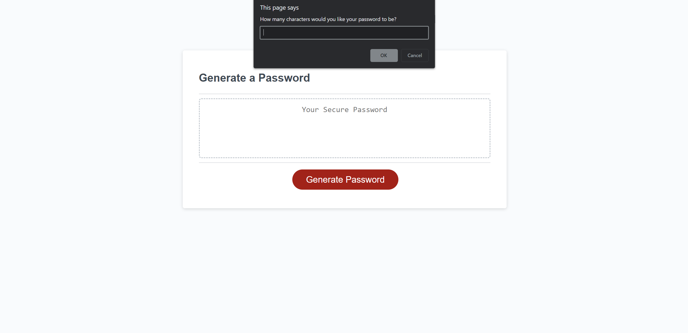
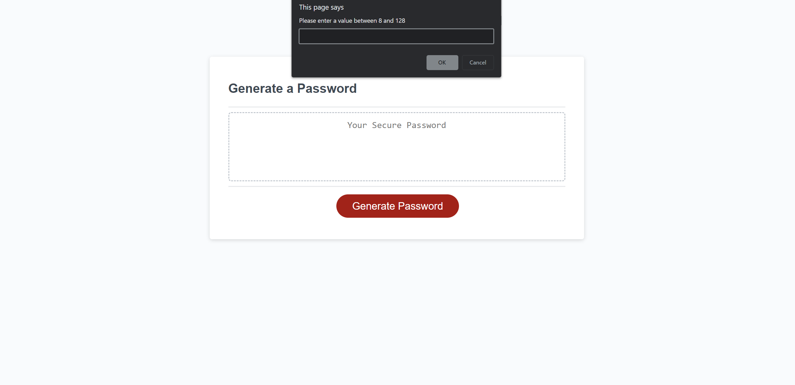
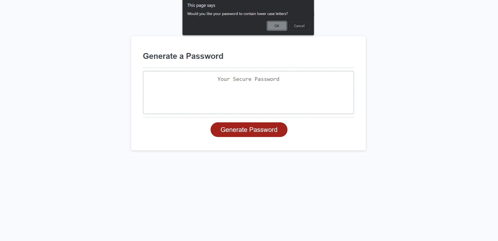
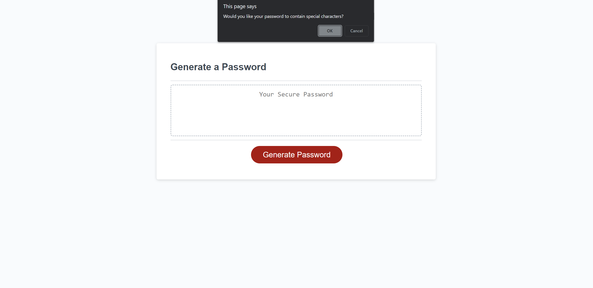
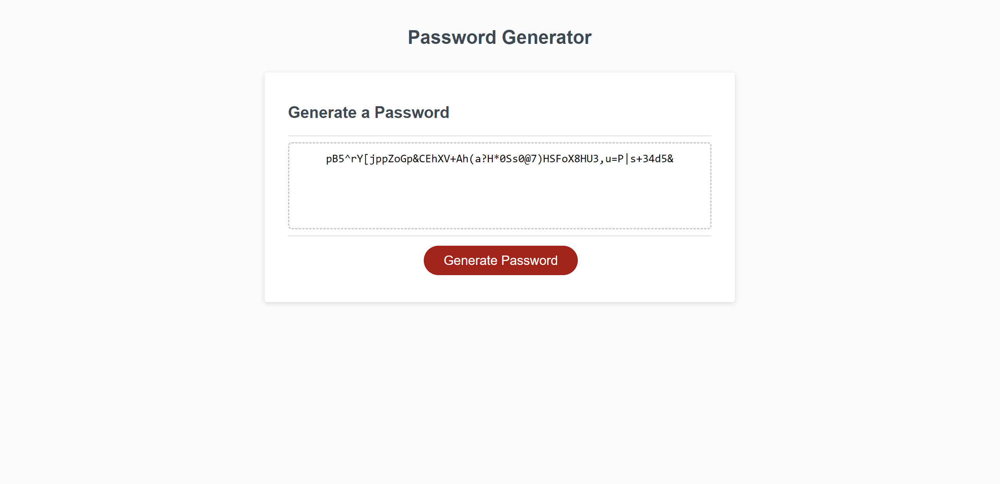

# passwordGenerator
This is a random password generator with between 8 and 128 characters.

You can select which types of characters you want in your password out of lower case, upper case, numbers or special characters.

It will include at least one of every selected character type.

I had a hard time with this assignment. I had missed some of the lecture explanation about how functions, for instance, are written due to a couple distractions. But, through various online resources I was able to fill in the missing bits of know-how for syntax that I didn't quite understand.

https://github.com/Osmilliardo/passwordGenerator

https://osmilliardo.github.io/passwordGenerator/

